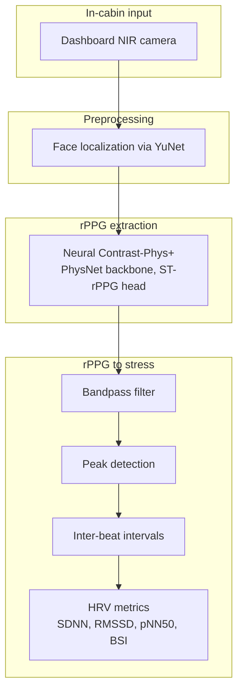
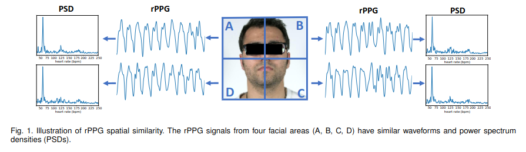
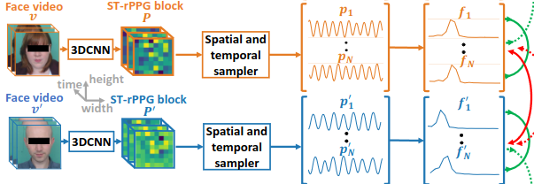
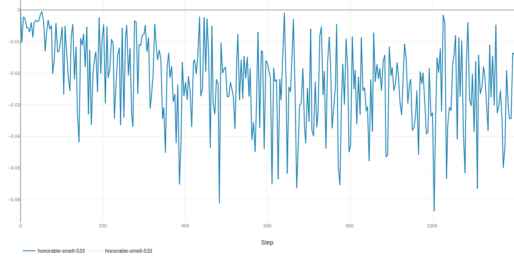
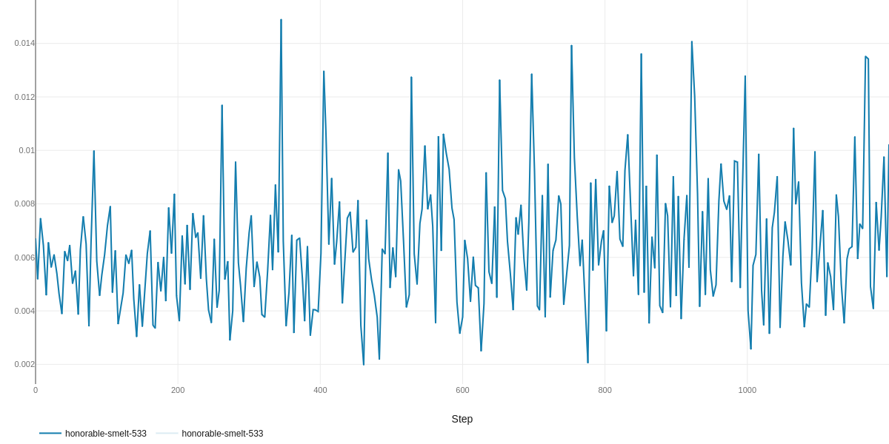
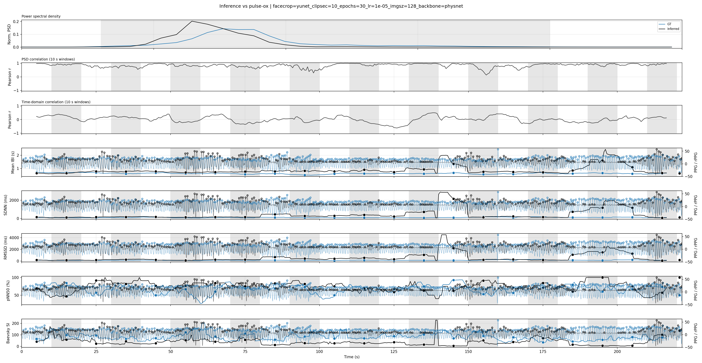
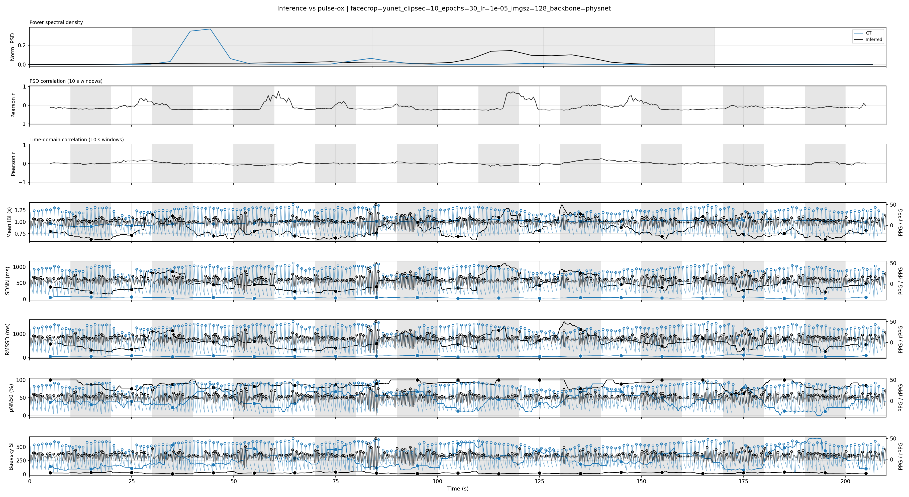
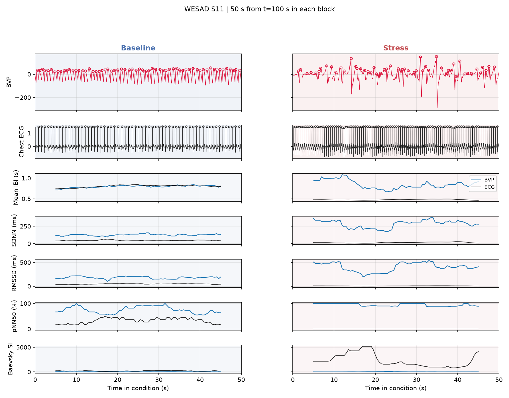
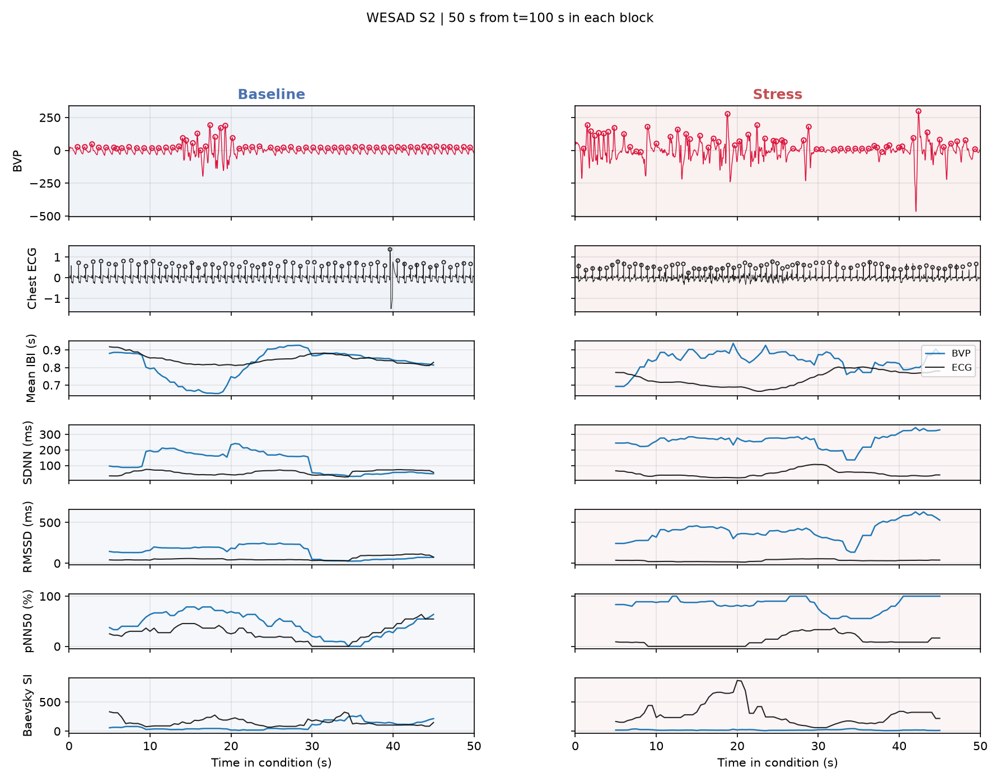

# In-Cabin Driver Stress Detection — Technical Report

## Problem Formulation

- **Goal**: Detect driver stress **in real time** from a single dashboard-mounted **NIR camera** without access to any proprietary data.
- **Scope**: A foundational algorithmic pipeline.

## Solution Sketch

### Background
- **Heart Rate Variability -> Stress Metrics**: Metrics such as Baevsky Stress Index, Standard Deviation of inter-beat intervals (SDNN) - see below - derived from Heart Rate Variability (HRV) can serve as indicators of stress. 
- **Remote PhotoPlethysmoGraphy (RPPG)**: A proxy for HRV can be found by measuring blood volume pulse. This can be extracted by computing changes in intensity from a camera capture.
  
### Challenges
- Higher signal noise due to low absorption rate of light by IR wavelengths 
- Motion artifacts due to driver or car movement

### Unsupervised Learning of rPPG Signals (ContrastPhys+)

Classical methods using handcrafted features are often not robust to the above challenges - since they depend on accurate ROI detection, and supervised approaches require the ground truth PPG signal. 

The approach chosen for this project is therefore Contrast-Phys+, proposed in 2024 by Sun et al [1].

### Solution Architecture

*Figure: end-to-end pipeline from NIR camera to stress metrics.*

## ContrastPhys+
The underlying principle of this approach is that rPPG signals generated by measuring the varying intensities at different locations in the face exhibit similarity when compared in the frequency domain (i.e when converted to Power Spectral Density). 

Taken from [1]

A 3DCNN is applied to a short video clip to extract temporal signals from various locations of the facial area after locating the face in the IR video. These temporal signals are matched in the **frequency domain** (i.e their difference becomes part of the training loss), when extracted from the video clip of the same study participant. On the other hand, if they belong to different participants, the training loss penalizes similarity between them in the **frequency domain**.

Taken from [1]

## Stress Metrics

All metrics are computed from a window of **inter-beat intervals (IBIs)** extracted by peak detection on a bandpass-filtered rPPG waveform. Let $\{IBI_i\}_{i=1}^{N}$ denote IBIs in **seconds**, with $N \geq 2$ beats in the analysis window. Successive differences are $\Delta_i = IBI_{i+1} - IBI_i$.

| Metric | Typical stress direction | Mathematical Expression |
|--------|-------------------------|------|
| SDNN | decreases under stress | $\overline{IBI} = \frac{1}{N}\sum_{i=1}^{N} IBI_i\\\text{SDNN} = \sqrt{\frac{1}{N-1}\sum_{i=1}^{N}\left(IBI_i - \overline{IBI}\right)^2}$ |
| RMSSD | decreases under stress | $\text{RMSSD} = \sqrt{\frac{1}{N-1}\sum_{i=1}^{N-1}\Delta_i^2}\\\Delta_i = IBI_{i+1} - IBI_i$ |
| pNN50 | decreases under stress | $\text{pNN50} = \frac{100}{N-1}\sum_{i=1}^{N-1}\mathbf{1}\mid\left(\mid\Delta_i\mid > 0.05\right)$ |
| Baevsky SI | increases under stress | $\text{SI} = \frac{AMo}{2 \cdot M_o \cdot M_{xDMn}} \\AMo = 100 \times \frac{n_{mode}}{N}\\M_{xDMn} = \max_i IBI_i - \min_i IBI_i$|

Implementation: `src/ir_stress/signals/stress_indicators.py`.

### SDNN

**Description.** The standard deviation of NN (normal-to-normal) intervals — here, all detected IBIs in the window. SDNN captures **overall heart-rate variability** from both sympathetic and parasympathetic influences over the full segment. It is one of the most widely used time-domain HRV measures.

**Stress interpretation.** Lower SDNN indicates reduced overall HRV, often associated with acute or chronic stress, fatigue, or sympathetic dominance. Higher SDNN generally reflects greater autonomic flexibility (context-dependent; very short windows can be noisy).

### RMSSD

**Description.** The root mean square of successive IBI differences. RMSSD is sensitive to **short-term, beat-to-beat variability** and is primarily driven by **parasympathetic (vagal)** modulation of heart rate.

**Stress interpretation.** Lower RMSSD indicates diminished vagal tone and less beat-to-beat flexibility, commonly observed under stress or sympathetic activation. Higher RMSSD suggests stronger parasympathetic influence and recovery capacity.

### pNN50

**Description.** The percentage of successive IBIs whose difference exceeds 50 ms. Like RMSSD, pNN50 reflects **high-frequency, parasympathetic-sensitive** HRV — it counts how often consecutive beats change substantially.

**Stress interpretation.** Lower pNN50 indicates a more rigid rhythm with fewer large successive changes — associated with stress and sympathetic dominance. Higher pNN50 indicates greater beat-to-beat flexibility.

### Baevsky Stress Index

**Description.** The Baevsky Stress Index (SI) quantifies **sympathetic nervous system activation** from the shape of the IBI distribution: how sharply beat intervals cluster around the modal value relative to the total spread. Unlike SDNN/RMSSD/pNN50, **higher SI directly indicates greater stress-related sympathetic tone**.

**Stress interpretation.** Higher SI means IBIs are concentrated tightly around the mode with limited range — a pattern linked to sympathetic dominance. Lower SI suggests a more dispersed, flexible rhythm.

## Dataset Used for Validation
- For ContrastPhys+ Pipeline: A subset of data from the MR-NIRP dataset [2], which contains NIR videos under different conditions (driving, parked, with and without driver motion) alongside ground truth PPG signals collected from PulseOxymeter.
- PPG to Stress Indicators: WESAD dataset [3], which contains data from different wearables alingside ground truth binary indication regarding stress (reported by study participants).

## Evaluation

### NIR to PPG
Unfortunately, the 3DCNN model was too large to appropriately trained on  my local machine, which did not have adequate compute resources. Several concessions were made - The image, as well as the training clip length had to be downsampled, only 4 subjects and a small subset of their collected data were used for training. Furthermore, instead of the recommended OpenFace, Yunet was used for face localization. All of these factors could have resulted in slower loss convergence (see below). 

Total loss over training steps

The model was trained using a contrastive loss - since these use two opposing objectives, they can be rather tricky to train. I noted that the positive loss (see below) was not decreasing as well, indicating that signals extracted from the spatio-temporal module for the same video clip may not be resulting in the same output - this could be due to a number of factors: lower resolution during training could have significantly reduced/distorted informative channels, Yunet could have improperly cropped faces, and head motion could have resulted in mismatch between extracted rPPGs in the same video clip

Positive loss over training steps

As a result, the performance of the model is not ideal. The following shows a "well-performing" example (from the train set) and an underperforming example (from the held out set)

Well-performing example (from training set)

The Pearsons correlation coefficient calculated between PSDs computed over 10 second sliding windows of GT and predicted data (2nd row) is high for the first example. Stress-indicators, that depend on heart-rate variability, align with each other in most of the time.

Under-performing example (from test set)

The Pearsons correlation coefficient calculated between PSDs computed over 10 second sliding windows of GT and predicted data (2nd row) is low for this example. Consequently, stress indicators also do not match well

### PPG to Stress Indicators
The Stress metrics calculated from BVP (65 Hz) and ECG (700 Hz) were plotted against ground-truth binary stress levels in the WESAD data to verify how well they indicate *stress*.

Preliminary tests showed that stress indicators calculated from ECG matched the GT labels better than those calculated from BVP. The higher signal-to-noise ratio and higher sampling frequency of ECG could be a reason for this.

IR images are typically sampled at even lower frequencies (30 FPS)*This could indicate that that the method could benefit from fusing other feacial features based stress-indicators, as well as some level of supervised training for mapping to a continuous stress value*

## Summary

This report outlines a foundational pipeline for in-cabin driver stress detection using only a dashboard-mounted NIR camera. The core idea is to recover a remote photoplethysmography (rPPG) signal from face video, derive inter-beat intervals, and map them to established heart-rate variability (HRV) stress proxies — SDNN, RMSSD, pNN50, and Baevsky Stress Index.

**Strategy.** Rather than training an end-to-end stress classifier without labeled in-cabin data, the approach decomposes the problem into two validated stages: (1) unsupervised rPPG extraction via Contrast-Phys+ [1], which learns pulse-band signals through spatiotemporal contrast in the frequency domain, and (2) deterministic computation of time-domain HRV metrics from detected peaks. This decomposition matches the IR sensing constraint — NIR captures hemoglobin pulsatility without color — and avoids the need for proprietary stress labels at training time.

**Proof of concept.** Two publicly available datasets were used to validate the riskiest assumptions separately. On a subset of the MR-NIRP driving dataset [2], a downsampled Contrast-Phys+ model was trained under compute-limited conditions (four subjects, shorter clips, reduced resolution, YuNet face crops). Training loss decreased but positive contrastive loss did not converge; rPPG quality was reasonable on some training clips (high windowed Pearson correlation with pulse-ox ground truth and aligned stress indicators) but weaker on held-out subjects. On the WESAD dataset [3], the same HRV metrics computed from chest ECG and wrist BVP clearly separated baseline from induced-stress protocol windows across subjects, with ECG-derived metrics tracking ground-truth stress labels more reliably than BVP.

**Conclusion.** The framework is viable in principle: the downstream metric layer is well supported by literature and demonstrated on WESAD, and the upstream rPPG path produces usable pulse traces under favorable conditions. The main engineering risk remains rPPG fidelity under real driving constraints — motion, low IR contrast, and face-tracking quality — which limited generalization in this PoC. A production system would need more compute for full-resolution Contrast-Phys+ training, robust face tracking (e.g. OpenFace), larger subject coverage, and likely fusion with complementary cues or weak supervision for calibrated stress scoring.

## References
- [1] Sun eta al., Contrast-Phys+ (TPAMI 2024)
- [2] Nowara et al., NIR imaging PPG during driving (IEEE TITS 2020)
- [3] Schmidt et al., WESAD (ICMI 2018)

---