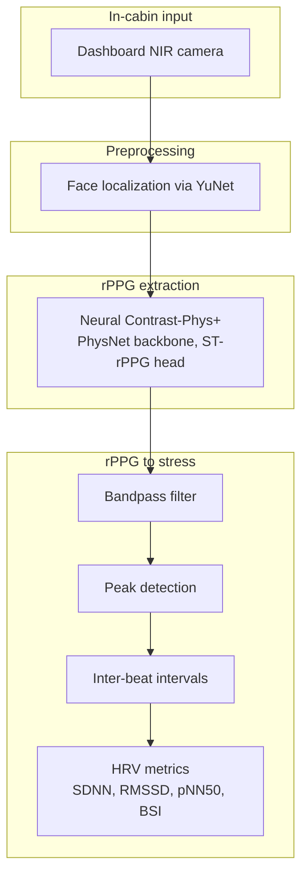

# In-Cabin Driver Stress Detection — Technical Report

## Problem Formulation

- **Goal**: Detect driver stress **in real time** from a single dashboard-mounted **NIR camera** without access to any proprietary data.
- **Scope**: A foundational algorithmic pipeline.

## Solution Sketch

### Background
- **Heart Rate Variability -> Stress Metrics**: Metrics such as Baevsky Stress Index, Standard Deviation of inter-beat intervals (SDNN) - see below - derived from Heart Rate Variability (HRV) can serve as indicators of stress. 
- **Remote PhotoPlethysmoGraphy (RPPG)**: A proxy for HRV can be found by measuring blood volume pulse. This can be extracted by computing changes in intensity from a camera capture.
  
### Challenges
- Higher signal noise due to low absorption rate of light by IR wavelengths 
- Motion artifacts due to driver or car movement

### Unsupervised Learning of rPPG Signals (ContrastPhys+)

Classical methods using handcrafted features are often not robust to the above challenges - since they depend on accurate ROI detection, and supervised approaches require the ground truth PPG signal. 

The approach chosen for this project is therefore Contrast-Phys+, proposed in 2024 by Sun et al [1].

### Solution Architecture


*Figure: end-to-end pipeline from NIR camera to stress metrics.*


## ContrastPhys+
The underlying principle of this approach is that rPPG signals generated by measuring the varying intensities at different locations in the face exhibit similarity when compared in the frequency domain (i.e when converted to Power Spectral Density). 


Taken from [1]

A 3DCNN is applied to a short video clip to extract temporal signals from various locations of the facial area after locating the face in the IR video. These temporal signals are matched in the **frequency domain** (i.e their difference becomes part of the training loss), when extracted from the video clip of the same study participant. On the other hand, if they belong to different participants, the training loss penalizes similarity between them in the **frequency domain**.


Taken from [1]

## Stress Metrics

All metrics are computed from a window of **inter-beat intervals (IBIs)** extracted by peak detection on a bandpass-filtered rPPG waveform. Let $\{IBI_i\}_{i=1}^{N}$ denote IBIs in **seconds**, with $N \geq 2$ beats in the analysis window. Successive differences are $\Delta_i = IBI_{i+1} - IBI_i$.

| Metric | Typical stress direction | Mathematical Expression |
|--------|-------------------------|------|
| SDNN | decreases under stress | $\overline{IBI} = \frac{1}{N}\sum_{i=1}^{N} IBI_i\\\text{SDNN} = \sqrt{\frac{1}{N-1}\sum_{i=1}^{N}\left(IBI_i - \overline{IBI}\right)^2}$ |
| RMSSD | decreases under stress | $\text{RMSSD} = \sqrt{\frac{1}{N-1}\sum_{i=1}^{N-1}\Delta_i^2}\\\Delta_i = IBI_{i+1} - IBI_i$ |
| pNN50 | decreases under stress | $\text{pNN50} = \frac{100}{N-1}\sum_{i=1}^{N-1}\mathbf{1}\mid\left(\mid\Delta_i\mid > 0.05\right)$ |
| Baevsky SI | increases under stress | $\text{SI} = \frac{AMo}{2 \cdot M_o \cdot M_{xDMn}} \\AMo = 100 \times \frac{n_{mode}}{N}\\M_{xDMn} = \max_i IBI_i - \min_i IBI_i$|

Implementation: `src/ir_stress/signals/stress_indicators.py`.

### SDNN

**Description.** The standard deviation of NN (normal-to-normal) intervals — here, all detected IBIs in the window. SDNN captures **overall heart-rate variability** from both sympathetic and parasympathetic influences over the full segment. It is one of the most widely used time-domain HRV measures.

**Stress interpretation.** Lower SDNN indicates reduced overall HRV, often associated with acute or chronic stress, fatigue, or sympathetic dominance. Higher SDNN generally reflects greater autonomic flexibility (context-dependent; very short windows can be noisy).

### RMSSD

**Description.** The root mean square of successive IBI differences. RMSSD is sensitive to **short-term, beat-to-beat variability** and is primarily driven by **parasympathetic (vagal)** modulation of heart rate.

**Stress interpretation.** Lower RMSSD indicates diminished vagal tone and less beat-to-beat flexibility, commonly observed under stress or sympathetic activation. Higher RMSSD suggests stronger parasympathetic influence and recovery capacity.

### pNN50

**Description.** The percentage of successive IBIs whose difference exceeds 50 ms. Like RMSSD, pNN50 reflects **high-frequency, parasympathetic-sensitive** HRV — it counts how often consecutive beats change substantially.


**Stress interpretation.** Lower pNN50 indicates a more rigid rhythm with fewer large successive changes — associated with stress and sympathetic dominance. Higher pNN50 indicates greater beat-to-beat flexibility.

### Baevsky Stress Index

**Description.** The Baevsky Stress Index (SI) quantifies **sympathetic nervous system activation** from the shape of the IBI distribution: how sharply beat intervals cluster around the modal value relative to the total spread. Unlike SDNN/RMSSD/pNN50, **higher SI directly indicates greater stress-related sympathetic tone**.

**Stress interpretation.** Higher SI means IBIs are concentrated tightly around the mode with limited range — a pattern linked to sympathetic dominance. Lower SI suggests a more dispersed, flexible rhythm.

## Dataset Used for Validation
- For ContrastPhys+ Pipeline: A subset of data from the MR-NIRP dataset [2], which contains NIR videos under different conditions (driving, parked, with and without driver motion) alongside ground truth PPG signals collected from PulseOxymeter.
- PPG to Stress Indicators: WESAD dataset [3], which contains data from different wearables alingside ground truth binary indication regarding stress (reported by study participants).


## Evaluation

### NIR to PPG
Unfortunately, the 3DCNN model was too large to appropriately train on  my local machine, which did not have adequate compute resources. Several concessions were made - The image, as well as the training clip length had to be downsampled, only 3 subjects were used for training. Furthermore, instead of the recommended OpenFace, Yunet was used for face localization. All of these factors could have resulted in slower loss convergence (see below). 


The model was trained using a contrastive loss - since these use two opposing objectives, they can be rather tricky to train. I noted that the positive loss was not decreasing as well, indicating that signals extracted from the spatio-temporal module for the same video clip may not be resulting in the same output

### PPG to Stress Indicators
The Stress metrics calculated from BVP (65 Hz) and ECG (700 Hz) were plotted against ground-truth binary stress levels in the WESAD data to verify how well they indicate *stress*.


Preliminary tests showed that stress indicators calculated from ECG matched the GT labels better than those calculated from BVP. The higher signal-to-noise ratio and higher sampling frequency of ECG could be a reason for this.

IR images are typically sampled at even lower frequencies (30 FPS)*This could indicate that that the method could benefit from the extraction of other *


## References
- [1] Sun eta al., Contrast-Phys+ (TPAMI 2024)
- [2] Nowara et al., NIR imaging PPG during driving (IEEE TITS 2020)
- [3] Schmidt et al., WESAD (ICMI 2018)

---

## Phase 1: Technical Strategy & Hypothesis

### Core hypothesis

- **Primary signal:** subtle blood-volume pulsatility in facial skin, visible in NIR as frame-to-frame intensity changes (remote photoplethysmography, rPPG)
- **Stress readout:** time-domain **heart-rate variability (HRV)** metrics derived from inter-beat intervals (IBIs) — sympathetic activation shifts rhythm regularity and variability
- **Key metrics:** Baevsky Stress Index (SI), SDNN, RMSSD, pNN50, mean HR (`src/ir_stress/signals/stress_indicators.py`)
- **Stress directionality:** higher Baevsky SI → more sympathetic tone; lower SDNN / RMSSD / pNN50 → reduced vagal flexibility under load

### Why this approach suits IR

- NIR penetrates superficial skin layers and is **less sensitive to melanin / skin tone** than visible RGB rPPG
- Pulsatile hemoglobin absorption is the dominant contrast mechanism — color channels are unnecessary
- Dashboard NIR cameras (940 nm band in MR-NIRP) are already used in automotive imaging; literature shows viable rPPG under driving motion
- Unsupervised **Contrast-Phys+** training avoids labeled stress data — only needs face video (+ optional pulse-ox GT for eval, not deployment)

### Literature & benchmarks informing the choice

- Sun & Li, **Contrast-Phys+** (TPAMI 2024) — spatiotemporal contrastive rPPG, MR-NIRP benchmark
- Nowara et al., **NIR imaging PPG during driving** (IEEE TITS 2020) — MR-NIRP dataset, in-cabin feasibility
- Martinez et al., **IR_iHR** (ICIP 2019) — classical optimal-SVD + synchrosqueezing baseline for NIR face video
- Schmidt et al., **WESAD** (ICMI 2018) — wearable BVP/ECG stress vs baseline for validating HRV metric separability (proxy ground truth, different sensor)
- Baevsky, **Stress Index** — clinical HRV-derived sympathetic proxy

### Alternatives considered (and why deferred)

- End-to-end deep stress classifier — rejected for PoC: no labeled in-cabin stress data, high overfit risk on a single IR stream
- Behavioral cues (gaze, blink rate) — complementary but secondary; harder to tie to autonomic ground truth without labels
- Classical green-channel rPPG — ill-suited to monochrome NIR input

---

## Phase 2: Algorithm Design & Mathematical Modeling

### System architecture

```
NIR video frames
    → face crop (OpenFace landmarks / YuNet)
    → rPPG extraction
         • neural: PhysNet backbone + ST-rPPG head (Contrast-Phys+)
         • classical: IR_iHR optimal-SVD grid + synchrosqueezing
    → bandpass filter + peak detection
    → IBI series
    → sliding-window HRV / Baevsky SI
    → stress metric time series
```

- Module map: `dataset/` → `models/` → `training/` → `evaluation/` → `inference/` → `signals/`
- Config & orchestration: Hydra dataclasses in `ir_stress.config`, scripts under `scripts/`

### Pipeline steps (raw IR → stress metric)

- **Acquisition:** 940 nm NIR PGM sequence @ 30 fps (MR-NIRP Car driving clips)
- **Preprocess:** landmark-guided or center face crop → `128×128×1` float tensor stored in H5 (`scripts/preprocess.py`)
- **rPPG inference:** 30 s sliding windows → 1-D pulse waveform (`scripts/inference.py`, `inference/pipeline.py`)
- **IBI extraction:** Elgendi-cleaned PPG + NeuroKit2 peak finding → \(\Delta t_i\) in seconds
- **Stress aggregation:** per-window Baevsky SI, SDNN, RMSSD, pNN50; optional sliding windows (10 s window, 0.5 s hop in exploration scripts)

### Core mathematical definitions

- **Normalized PSD (Contrast-Phys+ loss):** for signal \(x\), FFT power in physiological band \([f_{hp}, f_{lp}]\) normalized to unit mass — used for spatiotemporal contrastive sampling (`training/loss.py`)
- **Contrastive loss:** pull PSD of rPPG samples from same clip together, push apart across clips in a batch of 2; optional weak supervision with GT PPG (`ContrastLoss`)
- **Irrelevant Power Ratio (IPR):** fraction of rPPG spectral power outside the pulse band — training health metric (`training/ipr.py`); lower is better
- **Baevsky Stress Index:** \(\mathrm{SI} = \mathrm{AMo} / (2 \cdot M_o \cdot M_{xDMn})\) where \(M_o\) = mode IBI, AMo = % IBIs in modal bin, \(M_{xDMn}\) = IBI range
- **SDNN:** \(\mathrm{std}(\mathrm{IBI}) \times 1000\) ms; **RMSSD:** \(\sqrt{\mathrm{mean}(\Delta\mathrm{IBI}^2)} \times 1000\) ms; **pNN50:** % successive IBI differences > 50 ms
- **Evaluation:** Pearson \(r\) and MSE on bandpass-filtered, z-scored predicted vs pulse-ox PPG (`evaluation/evaluator.py`)

### Architecture diagram (to embed)

- [ ] Mermaid or figure: NIR → face crop → PhysNet + ST-rPPG head → rPPG → IBI → HRV panel
- [ ] Optional second branch: IR_iHR classical path for model-free baseline

---

## Phase 3: Proof of Concept & Conviction Plots

### Critical assumption under test

- **Assumption:** a usable pulse waveform can be extracted from dashboard NIR face video such that **HRV-derived stress indicators are computable and physiologically meaningful**
- PoC split into two validations:
  1. **rPPG recovery** — Contrast-Phys+ (or IR_iHR) produces a signal correlated with contact PPG (MR-NIRP) or stable enough for peak detection
  2. **HRV separability** — standard metrics differ between baseline and stress conditions (WESAD wearable proxy)

### Datasets & runs

| Source | Role | Location |
|--------|------|----------|
| MR-NIRP Car (940 nm NIR + pulse ox) | Train / eval rPPG; exploration plots | `data/raw/mr-nirp`, `data/h5*` |
| WESAD (BVP + ECG + protocol labels) | Validate HRV metrics baseline vs stress | `data/WESAD` |
| Synthetic clips | CI / smoke end-to-end without full dataset | `data/smoke_h5` |

- Leave-one-subject-out split: subject 1 held out (`checkpoints/*/split.json`, `val_subjects=[1]`)
- Training runs logged under MLflow experiment **`ir-stress-rppg`**; smoke runs under **`ir-stress-smoke`**

### Conviction plots (artifacts in `results/`)

#### A. rPPG training convergence (MLflow)

- **Where:** `mlflow ui --backend-store-uri sqlite:///mlflow.db` → experiment `ir-stress-rppg`
- **Metrics to cite:**
  - `loss`, `p_loss`, `n_loss` — contrastive objective decreasing over steps
  - `ipr` — irrelevant power ratio trending down (e.g. physnet_lite run `03fb1b86`: IPR 0.74 → 0.79 over 1308 steps; interpret alongside loss)
  - Per-step logging in `training/trainer.py`
- **Checkpoints:** `checkpoints/facecrop=center_clipsec=5_epochs=30_lr=1e-05_imgsz=128_backbone=physnet_lite/` (`epoch0.pt` … `epoch12.pt`, `config.json`)
- **Bullet — what this proves:** unsupervised contrastive training runs stably on MR-NIRP H5 clips; IPR/loss curves show the network concentrates spectral energy in the pulse band

#### B. rPPG vs ground-truth PPG (evaluation)

- **Where:** `checkpoints/smoke/facecrop=yunet_…/eval_results.csv` (smoke); full MR-NIRP eval TBD on completed 30-epoch runs
- **Smoke result:** Pearson \(r = 0.75\), MSE = 0.49 on `synthetic_0.h5` (1 epoch, YuNet crop, 64 px)
- **MLflow:** evaluate runs log `pearson_mean`, `mse_mean` + artifact CSV
- **Bullet — what this proves:** pipeline end-to-end produces rPPG aligned with GT PPG on held-out windows (smoke validates wiring; MR-NIRP numbers pending full training)

#### C. MR-NIRP data exploration — pulse-ox stress proxies over time

- **Where:** `results/subject{1,2,3,10,11}_exploration.png`
- **Script:** `scripts/data_exploration.py` — NIR frame montage + windowed Baevsky SI / SDNN / RMSSD / pNN50 from **contact pulse ox** (eval-only GT)
- **Bullet — what this proves:** stress metrics are well-defined on real in-cabin NIR sessions; shows temporal structure in HRV proxies during driving clips (not yet labeled stress vs calm)

#### D. WESAD baseline vs stress — HRV separability

- **Where:** `results/wesad_S{2–17}_baseline_stress_100s_50s.png` (15 subjects)
- **Script:** `scripts/visualize_WESAD_stress.py` — side-by-side baseline | stress: wrist BVP, chest ECG, sliding-window metrics
- **Window:** 100 s offset, 50 s duration per condition block
- **Bullet — what this proves:** Baevsky SI / SDNN / RMSSD / pNN50 **separate protocol baseline from induced stress** on wearable ground truth — validates the downstream metric layer even though sensor differs from IR

#### E. Neural inference on real MR-NIRP clip

- **Where:** `results/inference/subject1_subject1_driving_still_940_rppg.npy`, `_results.json`
- **Example output:** full-clip rPPG (6300 frames @ 30 fps), Baevsky SI ≈ 2.37 on recovered IBIs
- **Bullet — what this proves:** trained checkpoint + inference pipeline produce a continuous rPPG trace and computable SI from real NIR H5 input without pulse ox at inference time

#### F. IR_iHR classical baseline (no checkpoint)

- **Where:** `results/smoke_ihr/synthetic_0_*.npy`, `_results.json`
- **Script:** `inference.py extraction_method=ihr`
- **Bullet — what this proves:** model-free NIR rPPG path works as fallback / cross-check against Contrast-Phys+

#### G. Preprocessed clip previews

- **Where:** `results/subject*_subject*_driving_still_940_h5_preview.png`, `synthetic_0_h5_preview.png`
- **Bullet — what this proves:** face cropping and H5 pipeline preserve usable facial ROI across subjects

### Engineering analysis (summary bullets)

- [ ] rPPG extraction is the **gating risk** — without it, HRV layer has no input; MLflow IPR/loss + eval Pearson \(r\) address this directly
- [ ] WESAD plots de-risk the **metric layer** independently of IR rPPG quality
- [ ] MR-NIRP exploration shows metrics vary over time in realistic driving footage; next step is correlating with motion/still segments or external stress labels
- [ ] Full MR-NIRP leave-one-out Pearson benchmarks (paper target ~0.3–0.5 unsupervised) — pending completion of 30-epoch `physnet` / `physnet_lite` runs in `checkpoints/`
- [ ] Real-time path: 30 s eval windows, 30 fps → latency vs update rate trade-off to document for production

---

## Experiment Tracking & Artifacts

### MLflow (`mlflow.db`)

| Experiment | Purpose |
|------------|---------|
| `ir-stress-rppg` | Full MR-NIRP training + evaluation |
| `ir-stress-smoke` | Synthetic smoke-test train/eval |

- Logged params: model, face_size, clip_seconds, lr, label_ratio, h5_dir, device, …
- Logged metrics: `loss`, `p_loss`, `n_loss`, `p_loss_gt`, `n_loss_gt`, `ipr`; eval adds `pearson_mean`, `mse_mean`
- Artifacts: `config.json`, `split.json`, `epoch*.pt`, `eval_results.csv`

### Checkpoints (`checkpoints/`)

- Run naming: `facecrop={mode}_clipsec={T}_epochs={E}_lr={lr}_imgsz={S}_backbone={model}/`
- Completed / in-progress runs observed:
  - `facecrop=center_clipsec=5_epochs=30_lr=1e-05_imgsz=128_backbone=physnet_lite/` — epochs 0–12 saved
  - `clipsec=5_epochs=30_lr=1e-05_imgsz=64/` — epochs 0–1
  - `checkpoints/smoke/` — 1-epoch smoke weights for CI
- Each run directory: `config.json`, `split.json`, `epoch{N}.pt`

### Results (`results/`)

- `subject*_exploration.png` — MR-NIRP pulse-ox stress panels
- `wesad_S*_baseline_stress_*.png` — WESAD conviction plots
- `inference/` — neural rPPG + SI JSON/NPY outputs
- `smoke/`, `smoke_ihr/` — synthetic end-to-end outputs

---

## Reproducibility

- Install: `uv sync` (+ `uv sync --extra notebook` for plots)
- Smoke test: `uv run scripts/smoke_test.py`
- Conviction plots:
  - `uv run scripts/data_exploration.py`
  - `uv run scripts/visualize_WESAD_stress.py start_time=100 window_sec=50`
- Train + track: `uv run scripts/train.py` → `uv run mlflow ui --backend-store-uri sqlite:///mlflow.db`
- Evaluate: `uv run scripts/evaluate.py checkpoint=checkpoints/.../epochN.pt`
- Inference: `uv run scripts/inference.py checkpoint=... input_h5=...`

---

## Limitations & Next Steps

- [ ] No labeled in-cabin stress protocol — WESAD validates metrics, not IR-specific stress detection
- [ ] MR-NIRP provides pulse ox for rPPG eval only; stress ground truth in driving clips is implicit (motion / scene), not TSST-labeled
- [ ] Several `ir-stress-rppg` MLflow runs still **RUNNING** or **FAILED** (OOM / interrupted) — report final Pearson \(r\) once 30-epoch runs complete
- [ ] Face tracking under large head motion (975 nm large_motion clips) not yet evaluated
- [ ] Fuse IR rPPG stress stream with behavioral features; calibrate SI thresholds per subject
- [ ] Quantify baseline vs driving-stress separation on MR-NIRP once rPPG quality meets eval threshold

---

## References

- Sun & Li, Contrast-Phys+ (TPAMI 2024)
- Nowara et al., NIR imaging PPG during driving (IEEE TITS 2020)
- Martinez et al., IR_iHR (ICIP 2019)
- Schmidt et al., WESAD (ICMI 2018)
- Baevsky Stress Index / Kubios HRV methods
